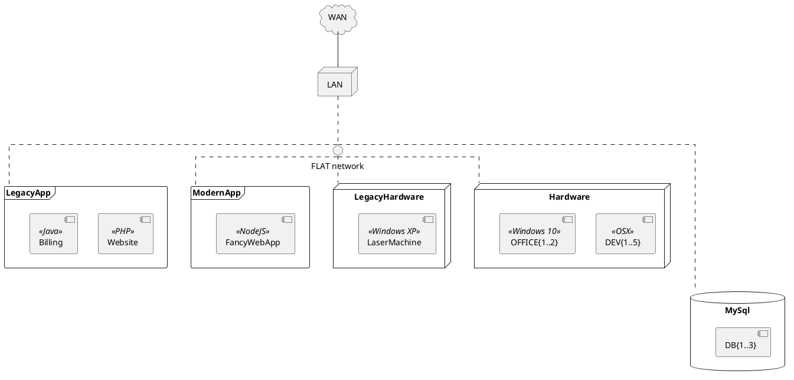

<h3>Let's go back to the 90s</h3>

---

# PlantUML Markdown

---

# PlantUML HTML

<pre>
<code class="plantuml">
@startuml
skinparam linetype ortho

cloud "WAN" as WAN
node "LAN" as LAN
interface "FLAT network" as FLAT

WAN -- LAN
LAN .. FLAT

frame "LegacyApp" as LegacyAPP {
[Website] <<PHP>>
[Billing] <<Java>>
}

frame "ModernApp" as APP {
[FancyWebApp] <<NodeJS>>
}

node "LegacyHardware" as LegacyHW{
[LaserMachine] <<Windows XP>>
}

node "Hardware" as HW {
[DEV{1..5}] <<OSX>>
[OFFICE{1..2}] <<Windows 10>>
}

database "MySql" as DB {
[DB{1..3}]
}

FLAT .. LegacyAPP
FLAT .. APP
FLAT .. LegacyHW
FLAT .. HW
FLAT ... DB
@enduml
</code>
</pre>